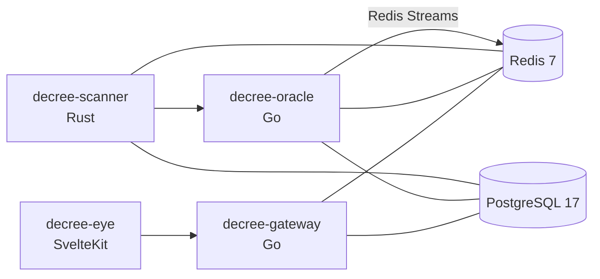

# DECREE

**Dynamic Realtime Exploit Classification & Evaluation Engine**

DECREE is a platform for continuously detecting and evaluating vulnerabilities in software and container dependencies, with an emphasis on practical risk rather than raw severity alone.  
Instead of replacing existing scanners outright, DECREE builds on SBOM generation and vulnerability matching, then focuses on classification, scoring, change detection, and visualization.

## What DECREE Aims To Do

- Continuously track vulnerabilities across dependencies
- Prioritize findings using CVSS plus exploitability and reachability signals
- Detect meaningful changes between scans
- Make those changes easier to understand through notifications and UI surfaces

## Current Status

This repository already runs as a multi-service system, but it is still evolving. As of today, the codebase primarily includes:

- `scanner`: SBOM-based analysis, OSV matching, EPSS/NVD/Exploit-DB enrichment, DECREE Score calculation
- `oracle`: scheduled scans, diff detection, Slack / Discord / generic webhook notifications
- `gateway`: HTTP entrypoint foundation and health checks
- `eye`: frontend foundation and health checks

At the same time, the public-facing REST API and the richer end-user UI are still in an early stage. This README only documents behavior that is supported by the current codebase.

## Architecture



| Service | Tech | Port | Responsibility |
|---|---|---:|---|
| `decree-scanner` | Rust | `9000` internal | Runs scans, materializes/parses SBOMs, enriches findings with OSV/EPSS/NVD/Exploit-DB, computes scores |
| `decree-oracle` | Go | `9100` internal | Manages targets, scheduling, diff detection, and notifications |
| `decree-gateway` | Go | `8400` | Public HTTP entrypoint |
| `decree-eye` | SvelteKit | `3400` | Frontend |
| PostgreSQL | - | `5434` host | Persistent storage |
| Redis | - | `6381` host | Streams and event delivery |

## Key Features

- Define Git repositories and container images as scan targets
- Generate and ingest SBOMs with Syft
- Match vulnerabilities through OSV
- Enrich findings with EPSS, NVD, and Exploit-DB data
- Compute a custom score based on `CVSS + EPSS + Reachability`
- Detect changes between scan results
- Send notifications to Slack, Discord, or an arbitrary webhook
- Run the full stack locally with Docker Compose

## DECREE Score

DECREE Score is designed to reflect not only severity, but also exploit likelihood and how reachable a dependency is in practice.

```text
DECREE Score = (CVSS_base × 0.4) + (EPSS × 100 × 0.35) + (Reachability × 0.25)
```

This formula reflects the current implementation and may evolve over time.

## Quick Start

### 1. Prerequisites

At minimum, you need:

- Docker
- Docker Compose

For local development, you will also want:

- Rust toolchain
- Go
- Node.js + `pnpm`
- `buf`
- `atlas`

### 2. Clone the repository

```bash
git clone https://github.com/Kaikei-e/DECREE.git
cd DECREE
```

### 3. Create the required secrets

Docker Compose reads secret values from files under `secrets/`. Some of them may be empty, but the files themselves must exist.

```bash
mkdir -p secrets

printf 'decree\n' > secrets/postgres_password.txt
touch secrets/nvd_api_key.txt
touch secrets/slack_webhook_url.txt
touch secrets/discord_webhook_url.txt
touch secrets/decree_webhook_token.txt
```

Notes:

- `postgres_password.txt` is required
- `nvd_api_key.txt` is optional, but recommended if you want more reliable NVD syncs
- If you do not use notifications yet, the webhook-related files can remain empty

### 4. Configure your scan targets

Define repositories and container images in [`decree.yaml`](/home/ice/dev/DECREE/decree.yaml). The default file contains placeholder examples. If you leave it unchanged, DECREE will try to scan `example/*` targets, so update it before real use.

Example:

```yaml
project:
  name: "my-project"

targets:
  repositories:
    - name: app
      url: https://github.com/your-org/your-repo
      branch: main

  containers:
    - name: app-image
      image: ghcr.io/your-org/your-image:latest
```

### 5. Start the stack

```bash
docker compose up --build -d
```

On first startup, this will build service images, apply database migrations, and initialize Redis Streams, so it may take a little while.

### 6. Verify that it is running

```bash
docker compose ps
curl http://localhost:8400/healthz
curl http://localhost:3400/healthz
```

Useful URLs:

- UI: `http://localhost:3400`
- Gateway health check: `http://localhost:8400/healthz`

## Configuration

### `decree.yaml`

[`decree.yaml`](/home/ice/dev/DECREE/decree.yaml) is the main runtime configuration file. It defines:

- project name
- repositories to monitor
- container images to monitor
- scan interval
- vulnerability refresh intervals
- diff tracking behavior
- notification channels

Important fields:

- `scan.interval`: how often scheduled scans run
- `scan.initial_scan`: whether to run an initial scan on startup
- `scan.vulnerability_refresh`: refresh cadence for EPSS / OSV / NVD related data
- `diff.track`: which changes to detect, such as `new_cve`, `resolved_cve`, `score_change`, and `new_exploit`

### Secrets

Notification endpoints and external credentials are loaded through Docker secrets.

| File | Purpose |
|---|---|
| `secrets/postgres_password.txt` | PostgreSQL password |
| `secrets/nvd_api_key.txt` | NVD API key |
| `secrets/slack_webhook_url.txt` | Slack webhook URL |
| `secrets/discord_webhook_url.txt` | Discord webhook URL |
| `secrets/decree_webhook_token.txt` | Generic webhook auth token |

## Local Development

### Service-by-service development

```bash
# scanner
cd services/scanner
cargo build
cargo test

# oracle
cd services/oracle
go build ./...
go test ./...

# gateway
cd services/gateway
go build ./...
go test ./...

# eye
cd services/eye
pnpm install
pnpm run dev
```

### Makefile targets

```bash
make up          # docker compose up -d
make down        # docker compose down
make build       # docker compose build
make proto       # buf generate
make migrate     # atlas migrate apply --env docker
make lint        # lint / vet across services
make test        # run service tests
make fmt         # format source code
make fmt-check   # verify formatting
```

## Repository Layout

```text
.
├── db/                  # schema and migrations
├── proto/               # Connect-RPC / Protobuf definitions
├── services/
│   ├── scanner/         # Rust scanner
│   ├── oracle/          # Go scheduler / diff / notifications
│   ├── gateway/         # Go HTTP gateway
│   └── eye/             # SvelteKit frontend
├── scripts/             # helper scripts
├── decree.yaml          # runtime target and behavior config
└── docker-compose.yml   # local stack definition
```

## Common Gotchas

- Docker Compose will fail if the `secrets/...` files do not exist
- Leaving the sample values in `decree.yaml` will make DECREE try to scan placeholder targets
- `scanner` uses Syft at runtime; the Docker image includes it, but local runs need the dependency installed
- External data sync depends on network access and upstream API limits
- `gateway` and `eye` are still foundational, so end-user functionality is currently limited

## License

Apache License 2.0. See [`LICENSE`](/home/ice/dev/DECREE/LICENSE) for details.
