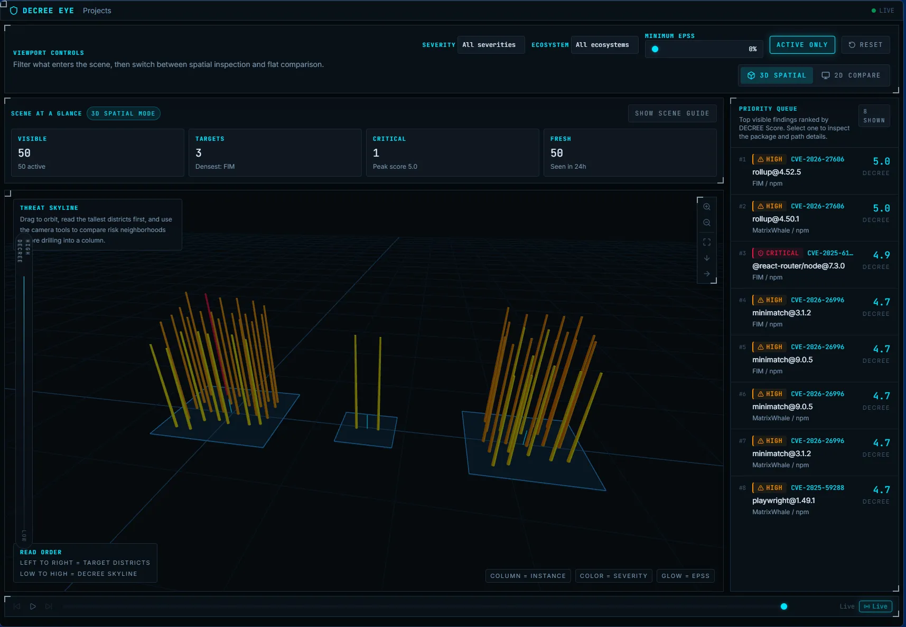
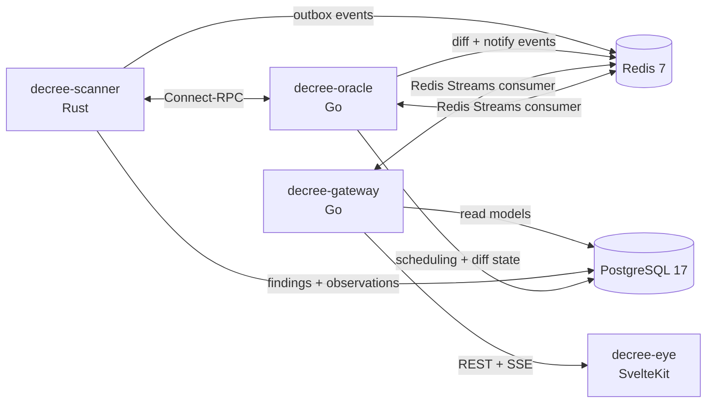

# DECREE

**Dynamic Realtime Exploit Classification & Evaluation Engine**

[](https://github.com/Kaikei-e/DECREE/actions/workflows/rust.yml)
[](https://github.com/Kaikei-e/DECREE/actions/workflows/go.yml)
[](https://github.com/Kaikei-e/DECREE/actions/workflows/frontend.yml)
[](https://github.com/Kaikei-e/DECREE/actions/workflows/infra.yml)
[](LICENSE)

DECREE is a multi-service vulnerability analysis platform that goes beyond "is this package vulnerable?" to answer **"how much should we care right now?"** It combines SBOM-based scanning, multi-source enrichment, prioritized scoring, change detection, and 3D spatial visualization into a single deployable stack.

<p align="center">
  
</p>

---

## Table of Contents

- [Why DECREE?](#why-decree)
- [Features](#features)
- [DECREE Score](#decree-score)
- [Architecture](#architecture)
- [Quick Start](#quick-start)
- [API Reference](#api-reference)
- [Configuration](#configuration)
- [Local Development](#local-development)
- [Repository Layout](#repository-layout)
- [Contributing](#contributing)
- [Acknowledgments](#acknowledgments)
- [License](#license)

---

## Why DECREE?

Scanners like Trivy and Grype are excellent at finding vulnerabilities. DECREE builds on their output and focuses on what happens next:

- **Prioritized scoring** — The DECREE Score blends CVSS severity, EPSS exploit probability, and reachability analysis into a single actionable number so you fix what matters first.
- **Change detection** — Every rescan produces a diff: new CVEs, resolved CVEs, score shifts, newly linked exploits. You see what changed, not just what exists.
- **Immutable audit trail** — An event-sourced data model ensures every observation and disappearance is recorded. Nothing is overwritten; the full history is always available.
- **Real-time streaming** — Finding and notification events flow through Redis Streams and are exposed as Server-Sent Events for live dashboards.
- **3D Threat Skyline** — A WebGPU spatial visualization renders your vulnerability landscape as a city of hexagonal columns — height encodes score, color encodes severity, glow encodes exploit likelihood.
- **Built-in notification routing** — Slack, Discord, and generic webhook channels with per-channel severity thresholds and deduplication.

## Features

### Scanning & Enrichment

- Container image and Git repository scanning via Syft
- SBOM ingestion in CycloneDX and SPDX formats
- OSV batch advisory matching against normalized packages
- EPSS, NVD, and Exploit-DB synchronization
- Automated score recalculation for active findings

### Change Detection & Notifications

- Target seeding from `decree.yaml` with scheduled rescans
- Diff detection for `new_cve`, `resolved_cve`, `score_change`, and `new_exploit`
- Multi-channel notifications (Slack, Discord, webhooks)
- Notification deduplication and delivery logging

### API & Visualization

- REST API with paginated findings, top risks, and timeline endpoints
- SSE endpoint for live finding and notification updates
- 3D Threat Skyline renderer (Three.js WebGL) with 2D canvas fallback
- Filter controls for severity, ecosystem, EPSS threshold, and active-only findings
- Detail panel with fix versions, exploit references, and dependency context

## DECREE Score

```text
DECREE Score = (CVSS_base × 0.4) + (EPSS × 100 × 0.35) + (Reachability × 0.25)
```

| Component | Weight | Source | Rationale |
|-----------|-------:|--------|-----------|
| CVSS base | 40 % | NVD | Intrinsic severity of the vulnerability |
| EPSS | 35 % | FIRST EPSS | Probability of exploitation within 30 days |
| Reachability | 25 % | Static analysis | Whether vulnerable code is actually reachable from exposed surfaces |

## Architecture



| Service | Tech | Port | Responsibility |
|---|---|---:|---|
| `decree-scanner` | Rust | `9000` internal | Runs scans, generates/parses SBOMs, matches OSV advisories, syncs EPSS/NVD/Exploit-DB, calculates scores |
| `decree-oracle` | Go | `9100` internal | Seeds configured targets, schedules scans, detects diffs, dispatches notifications |
| `decree-gateway` | Go | `8400` | Exposes REST endpoints and SSE over the read model |
| `decree-eye` | SvelteKit + Three.js | `3400` | Project browser and vulnerability visualization UI |
| PostgreSQL | — | `5434` host | Persistent store for scans, observations, projections, notifications |
| Redis | — | `6381` host | Streams for scan/finding/notification events |

<details>
<summary>Internal Scanner RPC Surface</summary>

`decree-oracle` talks to `decree-scanner` over JSON/HTTP Connect-style RPC routes:

- `/scanner.v1.ScannerService/RunScan`
- `/scanner.v1.ScannerService/GetScanStatus`
- `/scanner.v1.EnrichmentService/SyncEpss`
- `/scanner.v1.EnrichmentService/SyncNvd`
- `/scanner.v1.EnrichmentService/SyncExploitDb`
- `/scanner.v1.EnrichmentService/RecalculateScores`

</details>

## Quick Start

### 1. Prerequisites

Required:

- Docker
- Docker Compose

For local development:

- Rust toolchain
- Go
- Node.js + `pnpm`
- `buf`
- `atlas`

### 2. Clone the repository

```bash
git clone https://github.com/Kaikei-e/DECREE.git
cd DECREE
```

### 3. Create required secret files

Docker Compose expects these files to exist under `secrets/`, even if some values are empty.

```bash
mkdir -p secrets

printf 'decree\n' > secrets/postgres_password.txt
touch secrets/nvd_api_key.txt
touch secrets/slack_webhook_url.txt
touch secrets/discord_webhook_url.txt
touch secrets/decree_webhook_token.txt
```

Notes:

- `postgres_password.txt` is required
- `nvd_api_key.txt` is optional but recommended for more reliable NVD sync
- notification-related files may be left empty if you are not using those channels yet

### 4. Configure targets

DECREE reads runtime targets from `decree.yaml`.

You can start with repositories, container images, or both. A minimal example:

```yaml
project:
  name: "demo"

targets:
  repositories:
    - name: decree
      url: https://github.com/Kaikei-e/DECREE.git
      branch: main

  containers:
    - name: nginx
      image: nginx:latest

scan:
  interval: 10m
  initial_scan: true
```

### 5. Start the stack

```bash
docker compose up --build -d
```

On a fresh start this will:

- start PostgreSQL and Redis
- apply Atlas migrations
- initialize Redis consumer groups
- build and start the DECREE services
- seed configured targets
- trigger initial scans if `scan.initial_scan: true`

### 6. Verify health

```bash
docker compose ps
curl http://localhost:8400/healthz
curl http://localhost:3400/healthz
```

Open `http://localhost:3400` in your browser to access the visualization UI.

## API Reference

### Endpoints

| Method | Path | Notes |
|---|---|---|
| `GET` | `/healthz` | Health check |
| `GET` | `/api/projects` | List projects |
| `GET` | `/api/projects/{id}/targets` | List targets for a project |
| `GET` | `/api/projects/{id}/findings` | Paginated findings with filters |
| `GET` | `/api/findings/{instance_id}` | Finding detail |
| `GET` | `/api/projects/{id}/top-risks` | Highest-score active findings |
| `GET` | `/api/projects/{id}/timeline` | Observed/disappeared events |
| `GET` | `/api/events` | SSE stream |

### Findings query parameters

- `active_only=true|false`
- `severity=<label>`
- `ecosystem=<name>`
- `min_epss=<float>`
- `limit=<n>`
- `cursor=<opaque>`

### Timeline query parameters

- `target_id=<uuid>`
- `event_type=observed|disappeared`
- `from=<rfc3339>`
- `to=<rfc3339>`
- `limit=<n>`
- `cursor=<opaque>`

### Response shapes

- List endpoints return `{ "data": [...] }`
- Paginated endpoints return `{ "data": [...], "has_more": bool, "next_cursor": "..." }`
- Errors return `{ "error": { "code": "...", "message": "..." } }`

### Examples

```bash
# List projects
curl http://localhost:8400/api/projects

# List targets for a project
curl http://localhost:8400/api/projects/<project-id>/targets

# Active findings (paginated)
curl "http://localhost:8400/api/projects/<project-id>/findings?active_only=true&limit=20"

# Top risks
curl "http://localhost:8400/api/projects/<project-id>/top-risks?limit=10"

# Timeline
curl "http://localhost:8400/api/projects/<project-id>/timeline?limit=50"

# Live events (SSE)
curl -N http://localhost:8400/api/events
```

## Configuration

### `decree.yaml`

`decree.yaml` defines:

- project name
- repositories and containers to seed as targets
- scan interval
- initial scan behavior
- enrichment refresh cadence
- diff tracking settings
- notification channel config

Important fields:

- `scan.interval`: scheduler scan interval
- `scan.initial_scan`: whether startup triggers scans immediately
- `scan.vulnerability_refresh.epss`: EPSS refresh cadence
- `scan.vulnerability_refresh.nvd`: NVD refresh cadence
- `diff.track`: includes values such as `new_cve`, `resolved_cve`, `score_change`, `new_exploit`

### Secrets

The following files are wired into Docker Compose:

| File | Purpose |
|---|---|
| `secrets/postgres_password.txt` | PostgreSQL password |
| `secrets/nvd_api_key.txt` | NVD API key |
| `secrets/slack_webhook_url.txt` | Slack webhook URL |
| `secrets/discord_webhook_url.txt` | Discord webhook URL |
| `secrets/decree_webhook_token.txt` | Generic webhook auth token |

## Local Development

### Service-by-service

```bash
# scanner
cd services/scanner
cargo build
cargo test

# oracle
cd services/oracle
go build ./...
go test ./...

# gateway
cd services/gateway
go build ./...
go test ./...

# eye
cd services/eye
pnpm install
pnpm run dev
pnpm test
```

### Make targets

```bash
make up          # docker compose up -d
make down        # docker compose down
make build       # docker compose build
make proto       # buf generate
make migrate     # atlas migrate apply --env docker
make lint        # buf lint + clippy + go vet + biome
make test        # cargo test + go test + vitest
make fmt         # format source code
make fmt-check   # verify Go/Rust formatting
```

## Repository Layout

```text
.
├── db/                  # schema and migrations
├── proto/               # scanner RPC schema
├── services/
│   ├── scanner/         # scan pipeline and enrichment
│   ├── oracle/          # scheduler, diff engine, notifications
│   ├── gateway/         # read API and SSE
│   └── eye/             # visualization UI
├── scripts/             # helper scripts such as Redis init
├── decree.yaml          # runtime target and scheduler config
└── docker-compose.yml   # local stack
```

## Contributing

Contributions are welcome! Here's the quick version:

1. Fork the repository and create a feature branch
2. Follow the TDD workflow: write a failing test first, then implement
3. Run the relevant lint and test commands (see [Local Development](#local-development))
4. Open a pull request with a clear description of the change

For larger changes, please open an issue first to discuss the approach.

## Acknowledgments

DECREE builds on the work of many open-source projects:

- [Syft](https://github.com/anchore/syft) — SBOM generation
- [OSV](https://osv.dev/) — vulnerability advisory data
- [FIRST EPSS](https://www.first.org/epss/) — exploit prediction scoring
- [NVD](https://nvd.nist.gov/) — vulnerability severity data
- [Three.js](https://threejs.org/) — 3D visualization
- [Atlas](https://atlasgo.io/) — database schema management
- [Connect-RPC](https://connectrpc.com/) — inter-service communication

## License

Apache License 2.0. See [LICENSE](LICENSE) for details.
