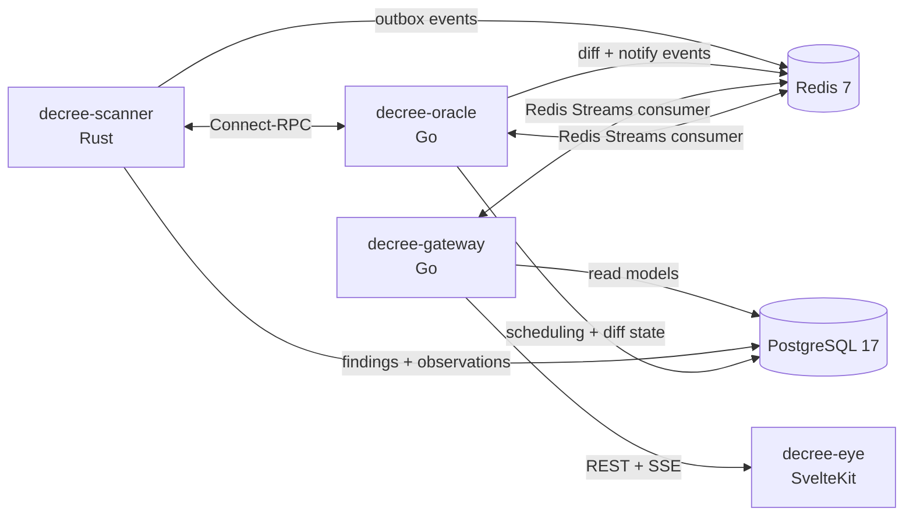

# DECREE

**Dynamic Realtime Exploit Classification & Evaluation Engine**

DECREE is a multi-service vulnerability analysis platform focused on one question: not just "is this package vulnerable?", but "how much should we care right now?"

It combines SBOM-based scanning, vulnerability enrichment, score calculation, diff detection, event streaming, and visualization. Rather than trying to be another all-in-one scanner, DECREE builds on existing inputs and emphasizes prioritization, change tracking, and operator-facing visibility.

## What DECREE Does

- Scans software supply chain targets and stores normalized findings
- Enriches findings with OSV, EPSS, NVD, and Exploit-DB data
- Computes a custom DECREE Score from severity, exploitability, and reachability
- Detects changes between scans such as new CVEs, resolved CVEs, score shifts, and newly linked exploits
- Publishes change events over Redis Streams and SSE
- Exposes project, target, finding, and timeline data over an HTTP API
- Includes a frontend for project selection, finding visualization, and finding detail inspection

## Current Status

This repository is no longer just a skeleton. The codebase now includes:

- `scanner` in Rust: target adapters, SBOM ingestion/generation, OSV matching, enrichment RPCs, outbox publishing
- `oracle` in Go: config seeding, scheduled scans, score refresh, diff detection, notification routing
- `gateway` in Go: REST API, paginated findings/timeline endpoints, SSE fan-out, PostgreSQL-backed queries
- `eye` in SvelteKit: project list, graph visualization, filters, detail drawer, renderer switching, timeline controls

There are still a few unfinished edges, but the core service integration is now largely aligned. This README reflects the code as it exists today, including the limitations that still matter for first-time users.

## Architecture



| Service | Tech | Port | Responsibility |
|---|---|---:|---|
| `decree-scanner` | Rust | `9000` internal | Runs scans, materializes/parses SBOMs, matches OSV advisories, syncs EPSS/NVD/Exploit-DB data, recalculates scores |
| `decree-oracle` | Go | `9100` internal | Seeds configured targets, schedules scans, detects diffs, dispatches notifications |
| `decree-gateway` | Go | `8400` | Exposes REST endpoints and SSE over the read model |
| `decree-eye` | SvelteKit + Three.js | `3400` | Project browser and vulnerability visualization UI |
| PostgreSQL | - | `5434` host | Persistent store for scans, observations, projections, notifications |
| Redis | - | `6381` host | Streams for scan/finding/notification events |

## Implemented Features

### Scanning and enrichment

- Container image scanning via Syft
- Internal support for Git, container, and raw SBOM target adapters in `scanner`
- OSV batch matching against normalized packages
- EPSS synchronization
- NVD synchronization
- Exploit-DB synchronization
- Score recalculation for active findings

### Diffing and notifications

- Initial scan seeding from `decree.yaml`
- Scheduled rescans at a configurable interval
- Diff detection for:
  - `new_cve`
  - `resolved_cve`
  - `score_change`
  - `new_exploit`
- Slack notifications
- Discord notifications
- Generic webhook notifications
- Notification deduplication and delivery logging

### Read API and UI

- Project listing
- Target listing
- Paginated findings API with filters
- Finding detail API with fix versions, exploit refs, and dependency edges
- Top risks API
- Timeline API
- SSE endpoint for live finding/notification updates
- Graph-based project view in `eye`
- 3D renderer with 2D fallback
- Filter controls for severity, ecosystem, EPSS, and active-only findings
- Detail panel for remediation and exploit context

## DECREE Score

The current implementation uses:

```text
DECREE Score = (CVSS_base × 0.4) + (EPSS × 100 × 0.35) + (Reachability × 0.25)
```

This is implementation state, not a long-term compatibility promise.

## Quick Start

### 1. Prerequisites

Required:

- Docker
- Docker Compose

For local development:

- Rust toolchain
- Go
- Node.js + `pnpm`
- `buf`
- `atlas`

### 2. Clone the repository

```bash
git clone https://github.com/Kaikei-e/DECREE.git
cd DECREE
```

### 3. Create required secret files

Docker Compose expects these files to exist under `secrets/`, even if some values are empty.

```bash
mkdir -p secrets

printf 'decree\n' > secrets/postgres_password.txt
touch secrets/nvd_api_key.txt
touch secrets/slack_webhook_url.txt
touch secrets/discord_webhook_url.txt
touch secrets/decree_webhook_token.txt
```

Notes:

- `postgres_password.txt` is required
- `nvd_api_key.txt` is optional but recommended for more reliable NVD sync
- notification-related files may be left empty if you are not using those channels yet

### 4. Configure targets

DECREE reads runtime targets from `decree.yaml`.

You can start with repositories, container images, or both. A minimal example:

```yaml
project:
  name: "demo"

targets:
  repositories:
    - name: decree
      url: https://github.com/Kaikei-e/DECREE.git
      branch: main

  containers:
    - name: nginx
      image: nginx:latest

scan:
  interval: 10m
  initial_scan: true
```

### 5. Start the stack

```bash
docker compose up --build -d
```

On a fresh start this will:

- start PostgreSQL and Redis
- apply Atlas migrations
- initialize Redis consumer groups
- build and start the DECREE services
- seed configured targets
- trigger initial scans if `scan.initial_scan: true`

### 6. Verify health

```bash
docker compose ps
curl http://localhost:8400/healthz
curl http://localhost:3400/healthz
```

Useful URLs:

- Gateway health: `http://localhost:8400/healthz`
- Eye health: `http://localhost:3400/healthz`
- Eye UI entrypoint: `http://localhost:3400`

### 7. Query the API directly

The gateway is currently the most trustworthy user-facing surface because its route contract is explicit in the code.

List projects:

```bash
curl http://localhost:8400/api/projects
```

List targets for a project:

```bash
curl http://localhost:8400/api/projects/<project-id>/targets
```

List active findings:

```bash
curl "http://localhost:8400/api/projects/<project-id>/findings?active_only=true&limit=20"
```

Top risks:

```bash
curl "http://localhost:8400/api/projects/<project-id>/top-risks?limit=10"
```

Timeline:

```bash
curl "http://localhost:8400/api/projects/<project-id>/timeline?limit=50"
```

Live events:

```bash
curl -N http://localhost:8400/api/events
```

## API Surface

The current gateway routes are:

| Method | Path | Notes |
|---|---|---|
| `GET` | `/healthz` | health check |
| `GET` | `/api/projects` | list projects |
| `GET` | `/api/projects/{id}/targets` | list targets for a project |
| `GET` | `/api/projects/{id}/findings` | paginated findings with filters |
| `GET` | `/api/findings/{instance_id}` | finding detail |
| `GET` | `/api/projects/{id}/top-risks` | highest-score active findings |
| `GET` | `/api/projects/{id}/timeline` | observed/disappeared events |
| `GET` | `/api/events` | SSE stream |

Supported findings query params:

- `active_only=true|false`
- `severity=<label>`
- `ecosystem=<name>`
- `min_epss=<float>`
- `limit=<n>`
- `cursor=<opaque>`

Supported timeline query params:

- `target_id=<uuid>`
- `event_type=observed|disappeared`
- `from=<rfc3339>`
- `to=<rfc3339>`
- `limit=<n>`
- `cursor=<opaque>`

Response shapes:

- list endpoints generally return `{ "data": [...] }`
- paginated endpoints return `{ "data": [...], "has_more": bool, "next_cursor": "..." }`
- errors return `{ "error": { "code": "...", "message": "..." } }`

## Internal Scanner RPC Surface

`decree-oracle` talks to `decree-scanner` over JSON/HTTP Connect-style RPC routes:

- `/scanner.v1.ScannerService/RunScan`
- `/scanner.v1.ScannerService/GetScanStatus`
- `/scanner.v1.EnrichmentService/SyncEpss`
- `/scanner.v1.EnrichmentService/SyncNvd`
- `/scanner.v1.EnrichmentService/SyncExploitDb`
- `/scanner.v1.EnrichmentService/RecalculateScores`

These are internal service endpoints, but they are useful to know when tracing behavior across the system.

## Configuration

### `decree.yaml`

`decree.yaml` defines:

- project name
- repositories and containers to seed as targets
- scan interval
- initial scan behavior
- enrichment refresh cadence
- diff tracking settings
- notification channel config

Important fields:

- `scan.interval`: scheduler scan interval
- `scan.initial_scan`: whether startup triggers scans immediately
- `scan.vulnerability_refresh.epss`: EPSS refresh cadence
- `scan.vulnerability_refresh.nvd`: NVD refresh cadence
- `scan.vulnerability_refresh.osv`: present in config, though scanner-side refresh behavior is currently centered on EPSS/NVD/Exploit-DB RPCs
- `diff.track`: includes values such as `new_cve`, `resolved_cve`, `score_change`, `new_exploit`

### Secrets

The following files are wired into Docker Compose:

| File | Purpose |
|---|---|
| `secrets/postgres_password.txt` | PostgreSQL password |
| `secrets/nvd_api_key.txt` | NVD API key |
| `secrets/slack_webhook_url.txt` | Slack webhook URL |
| `secrets/discord_webhook_url.txt` | Discord webhook URL |
| `secrets/decree_webhook_token.txt` | generic webhook auth token |

## Local Development

### Service-by-service

```bash
# scanner
cd services/scanner
cargo build
cargo test

# oracle
cd services/oracle
go build ./...
go test ./...

# gateway
cd services/gateway
go build ./...
go test ./...

# eye
cd services/eye
pnpm install
pnpm run dev
pnpm test
```

### Make targets

```bash
make up          # docker compose up -d
make down        # docker compose down
make build       # docker compose build
make proto       # buf generate
make migrate     # atlas migrate apply --env docker
make lint        # buf lint + clippy + go vet + biome
make test        # cargo test + go test + vitest
make fmt         # format source code
make fmt-check   # verify Go/Rust formatting
```

## Repository Layout

```text
.
├── db/                  # schema and migrations
├── proto/               # scanner RPC schema
├── services/
│   ├── scanner/         # scan pipeline and enrichment
│   ├── oracle/          # scheduler, diff engine, notifications
│   ├── gateway/         # read API and SSE
│   └── eye/             # visualization UI
├── scripts/             # helper scripts such as Redis init
├── decree.yaml          # runtime target and scheduler config
└── docker-compose.yml   # local stack
```

## Known Limitations

These are not hypothetical. They follow directly from the current source tree.

- Timeline controls and timeline state exist in the frontend, but the full end-to-end timeline replay flow is still only partially wired.
- There is no shipped `decree` CLI in the current source tree despite M6 planning notes mentioning one.

## License

Apache License 2.0. See `LICENSE` for details.
